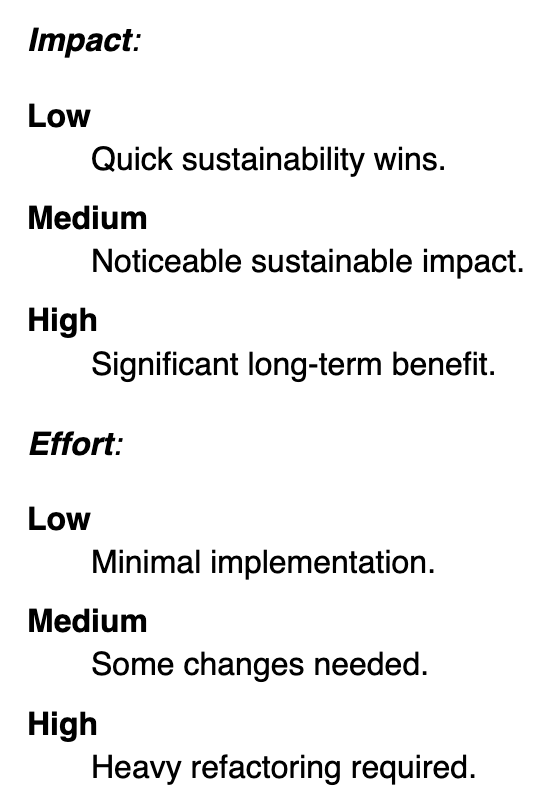

# WSG Scrapper

This small ruby script scraps the [Web Sustainability Guidelines (aka WSG)](https://w3c.github.io/sustyweb/) for it's titles and the corresponding ratings (Impact and Effort). The scrapping of data is then saved in a .json-file `wsg-titles-impacts-efforts.json`.

```
Note: WSG is still work in progress and is just a draft. Take this information with care
and think for yourself if the information applys to you and/or your organisation.
```

## Setup
Make sure you have Ruby installed. This script is tested with ruby version `ruby 3.0.6p216 (2023-03-30 revision 23a532679b) [arm64-darwin23]` on a MacBook Pro running MacOS 14.0.

Clone the repo, then in your terminal go to the folder and run:
```
bundle install
```
to install all the gems.

## Run the script
```
ruby main.rb
```
in the repo folder. This will save the data to a .json-file.

If you wish to have it as a .csv-file instead, add the argument `-csv` to the run command, i.e.
```
ruby main.rb -csv
```
and it should save the data to a .csv-file with the name `wsg-titles-impacts-efforts.csv`.

## WSG Impact and Effort definitions
As of 2023-11-01, WSGs definition of the three levels `Low`, `Medium`, `High` for `Impact` and `Effort` is:
